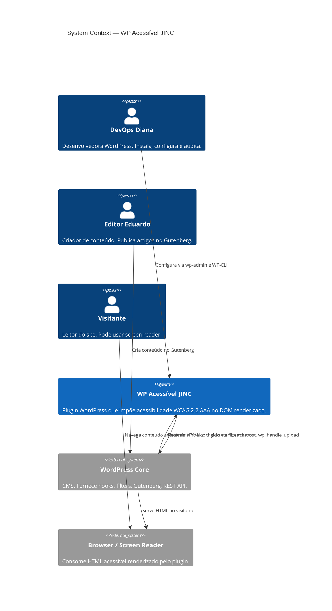
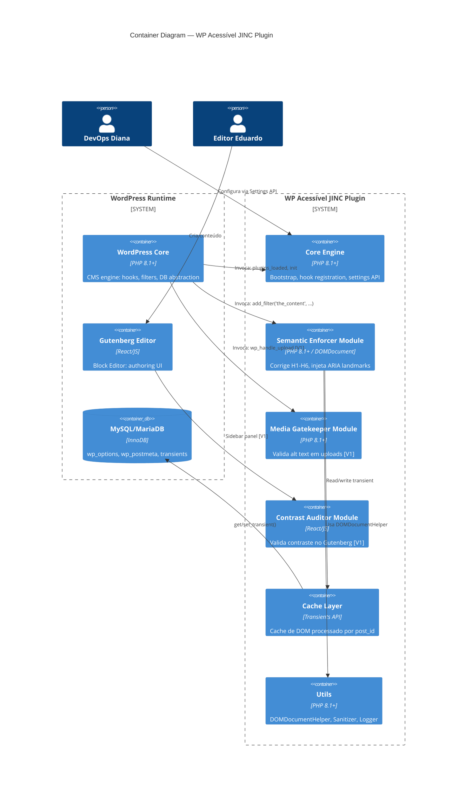
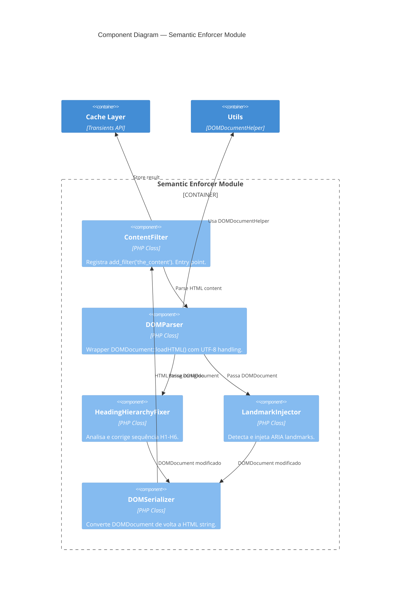

# WP Acessível JINC — Software Design Document

## 1. North Star

### Vision

Todo site WordPress publica conteúdo acessível por padrão — sem overlays, sem dependências externas, sem desculpas. Acessibilidade é resolvida no DOM real, no servidor, no momento do rendering.

### Problem Statement

O WordPress permite publicação de HTML semanticamente incorreto e inacessível. O mercado responde com overlays JavaScript que aplicam patches cosméticos sem compliance real, custando R$200-800/mês por site. 82% dos sites WordPress falham em critérios WCAG básicos. Não existe mecanismo nativo no pipeline de rendering que force conformidade de acessibilidade.

### Jobs to be Done (JTBD)

- **When** eu ativo o plugin em um site, **I want to** ter a semântica HTML corrigida automaticamente no output, **so I can** passar em auditorias WCAG sem editar cada página.
- **When** eu publico um artigo, **I want to** ser avisado de problemas de acessibilidade, **so I can** corrigir antes que o conteúdo vá ao ar.
- **When** eu preciso provar compliance, **I want to** rodar uma auditoria via WP-CLI, **so I can** ter evidência técnica sem ferramentas externas.

### Success Metrics (OKR-ready)

| Metric                                    | Baseline | Target | Timeline |
| ----------------------------------------- | -------- | ------ | -------- |
| Posts com hierarquia H1-H6 correta        | ~18%     | 100%   | MVP      |
| Overhead de `the_content` filter (p95)    | N/A      | < 5ms  | MVP      |
| Instalações ativas WordPress.org          | 0        | 500    | 6 meses  |

### Non-Goals (Explicit Exclusions)

- Não corrige acessibilidade de temas — atua somente no conteúdo (`the_content`).
- Não injeta overlays ou widgets JavaScript — correção é server-side no DOM real.
- Não cria tabelas customizadas no banco de dados — Lean Database principle.
- Não suporta PHP < 8.1 — tipagem estrita é requisito arquitetural.

---

## 2. Functional Scope

### User Personas

| Persona        | Context                                 | Primary Goal                         | Tech Literacy |
| -------------- | --------------------------------------- | ------------------------------------ | ------------- |
| DevOps Diana   | Desenvolvedora, mantém 15-30 sites      | Automatizar compliance WCAG          | High          |
| Editor Eduardo | Criador de conteúdo, 5-10 artigos/dia   | Publicar sem erros de acessibilidade | Low           |

### User Stories (Gherkin format)

**Epic: Semantic Enforcement:**

**Story US-001:** Correção automática de hierarquia de cabeçalhos

- **As a** DevOps Diana
- **I want to** ativar o plugin e ter H1-H6 corrigidos automaticamente no output
- **So that** todos os sites passem em auditoria de heading structure
- **Acceptance Criteria:**
  - [ ] Given post com H1→H4→H2, When `the_content` renderizado, Then output H1→H2→H3
  - [ ] Given post sem cabeçalhos, When renderizado, Then conteúdo passa inalterado
  - [ ] Given H2→H2→H2, When renderizado, Then mantém H2→H2→H2 (válido)

**Story US-002:** Injeção automática de landmarks ARIA

- **As a** DevOps Diana
- **I want to** ter blocos envelopados com landmarks ARIA
- **So that** screen readers naveguem por regiões
- **Acceptance Criteria:**
  - [ ] Given conteúdo sem landmarks, When renderizado, Then bloco principal em `<article>`
  - [ ] Given landmarks existentes, When renderizado, Then não duplica

### Feature Map

| Feature                   | Priority | Complexity | Phase |
| ------------------------- | -------- | ---------- | ----- |
| Heading Hierarchy Fixer   | P0       | M          | MVP   |
| ARIA Landmarks Injector   | P0       | M          | MVP   |
| Transients Cache Layer    | P0       | S          | MVP   |
| Media Gatekeeper          | P1       | L          | V1    |
| Contrast Auditor          | P1       | L          | V1    |
| DescreveAI Integration    | P2       | XL         | Scale |

---

## 3. Architecture C4

### Context Diagram (Level 1) — Who uses what?



### Container Diagram (Level 2) — What runs?



### Component Diagram (Level 3) — Semantic Enforcer Internal



### Architecture Decision Records (ADRs)

| #       | Decision                                                       | Rationale                                                                                                                 | Consequences                                               | Status      |
| ------- | -------------------------------------------------------------- | ------------------------------------------------------------------------------------------------------------------------- | ---------------------------------------------------------- | ----------- |
| ADR-001 | Usar `DOMDocument` para manipulação HTML — Regex proibido      | Regex não pode parsear HTML corretamente (CFG vs Regular Language). DOMDocument produz AST navegável e é nativo do PHP.    | Overhead de parsing. Requer wrappers para UTF-8 quirks.    | 🟢 Accepted |
| ADR-002 | Zero tabelas customizadas — Lean Database                      | Reduz complexidade de install/uninstall. Evita debt de migração. WordPress já tem `wp_options` e `postmeta`.              | Limitações para queries complexas futuras.                 | 🟢 Accepted |
| ADR-003 | Transients API para cache de DOM processado                    | Nativo do WordPress. Funciona com object cache (Redis/Memcached) se disponível. Zero dependência externa.                 | TTL management. Invalidação requer `save_post` hook.       | 🟢 Accepted |
| ADR-004 | `declare(strict_types=1)` em todo arquivo PHP                  | Previne type coercion silenciosa. Força disciplina de tipos. Padrão JINC.                                                | Pode quebrar em integrações com plugins que passam tipos errados. Mitigado com validação na fronteira. | 🟢 Accepted |
| ADR-005 | Filter priority `PHP_INT_MAX - 10` em `the_content`            | Garante execução após shortcodes, blocks, e outros filters. `-10` reserva espaço para plugins de segurança/output final. | Pode conflitar com plugins que também usam prioridade alta. Documentar. | 🟢 Accepted |
| ADR-006 | Arquitetura modular DDD: Core → Modules → Utils                | Separation of Concerns. Cada módulo (Enforcer, Gatekeeper, Auditor) é independente. Facilita testing e feature flags.     | Overhead de bootstrap (autoloader). Mitigado com lazy loading. | 🟢 Accepted |
| ADR-007 | UTF-8 handling via `mb_encode_numericentity()` + meta charset   | PHP `DOMDocument::loadHTML()` trata input como ISO-8859-1 por padrão. Wrapper necessário.                                 | Complexidade adicional no parser. Encapsulado em `DOMDocumentHelper`. | 🟢 Accepted |
| ADR-008 | Transient key: `jinc_se_{post_id}_{post_modified_hash}`       | `post_id` garante unicidade. `post_modified` hash garante invalidação automática em edição. Evita `md5($content)`.       | Não invalida em mudanças de settings globais. Mitigado com hook `update_option`. | 🟢 Accepted |

---

## 4. Data Contract

<!-- Skipped: Full OpenAPI spec — plugin uses WordPress REST API nativa, não expõe endpoints próprios no MVP -->
<!-- Skipped: Event schemas — MVP não usa event-driven architecture -->
<!-- Skipped: ER model — Zero tabelas customizadas (ADR-002) -->

### WordPress Hook/Filter Registry

| Hook/Filter                | Type   | Module            | Priority          | Callback                                  | Description                                            |
| -------------------------- | ------ | ----------------- | ----------------- | ----------------------------------------- | ------------------------------------------------------ |
| `the_content`              | Filter | Semantic Enforcer | `PHP_INT_MAX - 10`| `SemanticEnforcer::filterContent()`       | Corrige H1-H6 e injeta landmarks ARIA                 |
| `save_post`                | Action | Cache Layer       | `10`              | `CacheManager::invalidatePostTransient()` | Invalida transient do post editado                     |
| `update_option_jinc_*`     | Action | Cache Layer       | `10`              | `CacheManager::flushAllTransients()`      | Invalida todos os transients quando settings mudam     |
| `wp_handle_upload`         | Filter | Media Gatekeeper  | `10`              | `MediaGatekeeper::validateAltText()` [V1] | Valida alt text no upload                              |
| `admin_menu`               | Action | Core Engine       | `10`              | `SettingsPage::register()`                | Registra página de settings                            |
| `admin_init`               | Action | Core Engine       | `10`              | `SettingsPage::registerFields()`          | Registra campos de configuração                        |
| `enqueue_block_editor_assets` | Action | Contrast Auditor | `10`           | `ContrastAuditor::enqueueAssets()` [V1]   | Carrega sidebar panel no Gutenberg                     |
| `plugins_loaded`           | Action | Core Engine       | `10`              | `Bootstrap::init()`                       | Inicializa plugin, carrega módulos                     |

### Data Model — wp_options

```php
<?php declare(strict_types=1);

/**
 * Settings stored in wp_options under key: 'wp_acessivel_jinc_settings'
 *
 * @spec-ref FR-001, FR-002, FR-004, FR-005
 */
$default_settings = [
    'modules' => [
        'semantic_enforcer' => [
            'enabled'              => true,    // bool — master switch
            'fix_heading_hierarchy'=> true,    // bool — H1-H6 correction
            'inject_landmarks'     => true,    // bool — ARIA landmarks
            'filter_priority'      => PHP_INT_MAX - 10, // int — the_content priority
        ],
        'media_gatekeeper' => [
            'enabled'              => false,   // bool — V1, disabled by default
            'block_publish'        => true,    // bool — block publish on missing alt
            'allow_decorative'     => true,    // bool — allow empty alt for decorative
        ],
        'contrast_auditor' => [
            'enabled'              => false,   // bool — V1, disabled by default
            'min_ratio'            => 7.0,     // float — WCAG AAA = 7:1
            'block_publish'        => false,   // bool — warn only by default
        ],
    ],
    'cache' => [
        'enabled'      => true,     // bool — Transients cache
        'ttl_seconds'  => 86400,    // int — 24h default TTL
    ],
    'debug' => [
        'log_processing' => false,  // bool — log to error_log()
    ],
];
```

### Transient Schema

| Key Pattern                                      | Value Type    | TTL        | Invalidation                          |
| ------------------------------------------------ | ------------- | ---------- | ------------------------------------- |
| `jinc_se_{post_id}_{md5(post_modified)}`         | `string` HTML | 24h (config)| `save_post` action on that post_id    |
| `jinc_se_stats`                                  | `array` JSON  | 1h         | Any `save_post` or `update_option`    |

---

## 5. Tech Stack & Constraints

### Chosen Stack

| Layer           | Technology                  | Version    | Rationale                                                |
| --------------- | --------------------------- | ---------- | -------------------------------------------------------- |
| Runtime         | PHP                         | 8.1+       | Strict types, enums, readonly, fibers, named args        |
| CMS             | WordPress                   | 6.4+       | Hooks/Filters API, Transients, Settings API, Gutenberg   |
| DOM Engine      | `ext-dom` (DOMDocument)     | PHP native | AST-based HTML manipulation. Zero dependencies.          |
| Cache           | Transients API              | WP native  | Works with object cache (Redis/Memcached) if available   |
| Database        | MySQL / MariaDB             | via `$wpdb`| Zero custom tables. `wp_options` + `wp_postmeta` only.   |
| Editor UI (V1)  | React (Gutenberg SlotFill)  | WP bundled | Block Editor sidebar panels. No external React.          |
| Testing         | PHPUnit + WP Test Utils     | 10.x       | WordPress testing framework. Mocked hooks/filters.       |
| Linting         | PHPStan (level 8) + PHPCS   | latest     | Static analysis + WordPress coding standards             |
| CI              | GitHub Actions              | —          | PR checks: PHPStan, PHPCS, PHPUnit                      |

### Hard Constraints

- `declare(strict_types=1)` — every PHP file, no exceptions (ADR-004)
- `DOMDocument` only — Regex for HTML is forbidden (ADR-001)
- Zero custom DB tables — Lean Database (ADR-002)
- Transients for all heavy processing cache (ADR-003)
- WordPress Plugin Guidelines compliance — no phone-home, no tracking
- GPL-2.0-or-later license — WordPress ecosystem requirement
- No external HTTP requests in MVP — all processing local

### Known Limitations

| Limitation                                              | Impact                                       | Mitigation                                       | Revisit At |
| ------------------------------------------------------- | -------------------------------------------- | ------------------------------------------------ | ---------- |
| `DOMDocument::loadHTML()` adds `<html><body>` wrappers  | Must strip wrapper tags after processing     | `DOMSerializer` handles extraction               | Stable     |
| `DOMDocument` treats input as ISO-8859-1 by default     | UTF-8 characters corrupted                   | `DOMDocumentHelper` with charset meta injection  | Stable     |
| Transients stored in `wp_options` without object cache   | DB queries per cache read on shared hosting  | Recommend Redis/Memcached. Document in README.   | V1         |
| `PHP_INT_MAX - 10` priority may conflict                | Other plugins using same high priority       | Document. Provide settings UI to change priority.| MVP        |

---

## 6. Business Rules Engine

### Rule BR-SE-001: Heading Hierarchy Must Be Sequential

| Condition                    | Value                                | Action                                            |
| ---------------------------- | ------------------------------------ | ------------------------------------------------- |
| Heading level skips detected | H1→H4 (skipped H2, H3)              | Remap: H4→H2, subsequent levels adjusted          |
| First heading is not H1      | Starts at H2 or H3                   | Accept — post may be inside `<article>` with H1 in template |
| No headings in content       | Zero `<h[1-6]>` tags                 | Pass through — no modification                    |
| Headings at same level       | H2→H2→H2                            | Valid — no modification needed                    |
| Heading inside blockquote    | `<blockquote><h3>...</h3></blockquote>` | Include in hierarchy analysis — context-independent |

### Rule BR-SE-002: Landmarks ARIA Must Not Duplicate

| Condition                        | Value                          | Action                                         |
| -------------------------------- | ------------------------------ | ---------------------------------------------- |
| Content has no `<article>` tag   | Missing landmark               | Wrap main content block in `<article>`         |
| Content already has `<article>`  | Landmark present               | No modification — preserve existing            |
| Content has `role="article"`     | ARIA role present              | No modification — equivalent to `<article>`    |
| Multiple content sections        | 2+ distinct sections           | Each gets own landmark with unique `aria-label`|

### Rule BR-SE-003: DOM Processing Must Be Idempotent

```pseudo
IF process(content) == content_already_processed
THEN output MUST equal input — no cumulative mutations
```

Running the Semantic Enforcer twice on the same content MUST produce identical output. This prevents corruption when content is rendered multiple times (preview, cache rebuild, RSS).

### Rule BR-CACHE-001: Cache Must Invalidate on Content Change

| Condition                                | Action                                                       |
| ---------------------------------------- | ------------------------------------------------------------ |
| `save_post` fired for post_id            | Delete transient `jinc_se_{post_id}_*`                       |
| `update_option` on `jinc_*` settings     | Flush ALL `jinc_se_*` transients                             |
| Plugin deactivation                      | Flush ALL `jinc_*` transients (cleanup)                      |
| Cache miss (transient expired or absent) | Process content, store result, return processed HTML         |
| Cache hit                                | Return cached HTML directly — skip DOMDocument processing    |

### Edge Cases & Error Scenarios

| Scenario                                         | Expected Behavior                                            | Error Code         |
| ------------------------------------------------ | ------------------------------------------------------------ | ------------------ |
| `DOMDocument::loadHTML()` throws on malformed HTML| Catch `DOMException`, return original content unmodified     | Silent — `error_log()` |
| Post content is empty string                     | Return empty string — no processing                          | —                  |
| Post content is only whitespace                  | Return as-is — no processing                                 | —                  |
| Post content exceeds 500KB                       | Skip processing, return original, log warning                | Silent — performance guard |
| Transient read fails (DB issue)                  | Process without cache, return result, log warning            | Silent — graceful  |

---

## 7. Definition of Done

### Technical DoD (Must pass before merging)

- [ ] Unit tests cover all business rules (≥ 80% line coverage)
- [ ] Integration tests for `the_content` filter with 20+ HTML fixtures
- [ ] PHPStan level 8 passes with zero errors
- [ ] PHPCS WordPress Coding Standards passes
- [ ] `declare(strict_types=1)` present in every PHP file
- [ ] No Regex used for HTML manipulation (grep validation)
- [ ] Idempotency test passes (double-processing produces same output)
- [ ] Performance test: `the_content` filter < 5ms with cache, < 50ms without (for 10KB content)
- [ ] Plugin activation/deactivation hooks clean up transients
- [ ] No custom DB tables created (grep `CREATE TABLE` validation)
- [ ] Admin UI accessible via keyboard and screen reader
- [ ] `checklist.py` passes without critical blockers
- [ ] PR reviewed by at least 1 team member

### Business DoD (Must be validated before release)

- [ ] Semantic Enforcer corrects heading hierarchy correctly on 50+ real-world posts
- [ ] ARIA landmarks injected without visual layout changes
- [ ] Plugin does not break any theme's existing layout (tested with Twenty Twenty-Four, Flavflavor theme)
- [ ] WP-CLI `wp jinc-a11y audit` command returns correct results
- [ ] README.md with installation, configuration, and FAQ
- [ ] WordPress.org plugin directory compliance (headers, assets, screenshots)

### Observability DoD

- [ ] Processing errors logged to `error_log()` with `[WP-Acessível-JINC]` prefix
- [ ] Debug mode (`log_processing: true`) logs every filter invocation with timing
- [ ] WP-CLI `wp jinc-a11y status` reports cache hit rate and module states

---

## 8. Delivery Phases

### Phase 0 — Foundation (Week 1-2)

**Goal:** Plugin skeleton, CI pipeline, testing infrastructure

- [ ] Repository structure with DDD directory layout
- [ ] `composer.json` with PHPUnit, PHPStan, PHPCS
- [ ] GitHub Actions CI: lint + test on PR
- [ ] Plugin bootstrap (`wp-acessivel-jinc.php` + autoloader)
- [ ] Settings API integration (`wp_acessivel_jinc_settings`)
- [ ] `DOMDocumentHelper` utility with UTF-8 handling
- [ ] First PHPUnit test passing in CI

### Phase 1 — MVP: Semantic Enforcer (Week 3-6)

**Goal:** Core value delivered — heading hierarchy + ARIA landmarks automated

**Scope:**

- US-001: Heading Hierarchy Fixer
- US-002: ARIA Landmarks Injector
- Cache Layer (Transients)
- Admin Settings Page (enable/disable modules)
- WP-CLI: `wp jinc-a11y audit`, `wp jinc-a11y status`

**NOT in MVP (explicitly excluded):**

- Media Gatekeeper (FR-010) — deferred to V1 (requires Gutenberg JS integration)
- Contrast Auditor (FR-011) — deferred to V1 (requires React sidebar component)
- DescreveAI integration — deferred to Scale (external API dependency)

**MVP Exit Criteria:**

- [ ] Plugin installable via WordPress admin or WP-CLI
- [ ] Heading hierarchy corrected on 100% of test fixtures
- [ ] ARIA landmarks injected without visual side effects
- [ ] Cache functioning with > 90% hit rate in steady state
- [ ] Performance: < 5ms per `the_content` invocation (cached)
- [ ] Zero regressions on theme layout (3 themes tested)

### Phase 2 — V1: Editor Integration (Week 7-12)

**Goal:** Block Editor becomes accessibility-aware

**Scope:**

- Media Gatekeeper: Block publish on missing alt text
- Contrast Auditor: Real-time ratio check in Gutenberg sidebar
- Editor status panel: Accessibility score per post
- Improved WP-CLI: `wp jinc-a11y fix --post_id=123`

### Phase 3 — Scale

**Goal:** Ecosystem growth and advanced features

- DescreveAI integration for AI-generated alt text
- VPAT report generation
- Dashboard with site-wide accessibility score
- Multi-site support
- Performance optimization for sites with 10k+ posts

### Risk Register

| Risk                                                       | Probability | Impact | Mitigation                                                           |
| ---------------------------------------------------------- | ----------- | ------ | -------------------------------------------------------------------- |
| DOMDocument alters whitespace/encoding                     | High        | Medium | Comprehensive test fixtures. DOMSerializer strips wrappers.          |
| Cache plugins conflict (WP Super Cache, W3 Total Cache)    | Medium      | High   | Document hook priorities. Test with top 5 cache plugins.             |
| Themes with existing landmarks — duplication               | Medium      | Medium | Detection before injection. Idempotency rule BR-SE-002.             |
| PHP 8.1 requirement excludes shared hosting users          | Low         | Medium | Document clearly. WP trends: 70%+ already PHP 8.0+.                 |
| High-priority filter conflicts with security plugins       | Low         | High   | Configurable priority in settings. Default: `PHP_INT_MAX - 10`.      |

---

## Directory Structure (DDD Layout)

```
wp-acessivel-jinc/
├── wp-acessivel-jinc.php              ← Plugin entry point (WordPress header)
├── composer.json                       ← Dependencies: PHPUnit, PHPStan, PHPCS
├── uninstall.php                       ← Cleanup: remove options and transients
│
├── src/                                ← Source code (autoloaded via Composer PSR-4)
│   ├── Core/                           ← Core Engine (bootstrap, settings, lifecycle)
│   │   ├── Bootstrap.php               ← Plugin initialization, module loading
│   │   ├── SettingsPage.php            ← Admin settings UI (Settings API)
│   │   ├── SettingsSchema.php          ← Default values, validation, sanitization
│   │   └── HookRegistry.php           ← Central registry of all hooks/filters
│   │
│   ├── Modules/                        ← Feature modules (DDD bounded contexts)
│   │   ├── SemanticEnforcer/           ← MVP Module
│   │   │   ├── ContentFilter.php       ← add_filter('the_content') handler
│   │   │   ├── HeadingHierarchyFixer.php ← H1-H6 correction logic
│   │   │   ├── LandmarkInjector.php    ← ARIA landmarks injection
│   │   │   └── DOMSerializer.php       ← DOMDocument → HTML string
│   │   │
│   │   ├── MediaGatekeeper/            ← V1 Module
│   │   │   └── AltTextValidator.php
│   │   │
│   │   └── ContrastAuditor/            ← V1 Module (JS assets in assets/)
│   │       └── ContrastValidator.php
│   │
│   └── Utils/                          ← Shared utilities
│       ├── DOMDocumentHelper.php       ← DOMDocument wrapper (UTF-8, error handling)
│       ├── CacheManager.php            ← Transients API wrapper
│       ├── Logger.php                  ← Structured logging to error_log()
│       └── Sanitizer.php              ← Input sanitization wrappers
│
├── assets/                             ← Frontend assets
│   ├── js/                             ← Gutenberg sidebar scripts (V1)
│   └── css/                            ← Admin styles
│
├── tests/                              ← Test suite
│   ├── Unit/                           ← PHPUnit unit tests
│   │   ├── HeadingHierarchyFixerTest.php
│   │   ├── LandmarkInjectorTest.php
│   │   ├── DOMDocumentHelperTest.php
│   │   └── CacheManagerTest.php
│   ├── Integration/                    ← WordPress integration tests
│   │   └── ContentFilterIntegrationTest.php
│   ├── Fixtures/                       ← HTML test fixtures
│   │   ├── heading-skip-h1-h4.html
│   │   ├── heading-correct.html
│   │   ├── landmarks-missing.html
│   │   └── landmarks-existing.html
│   └── bootstrap.php                  ← WP test bootstrap
│
├── docs/                               ← Documentation (this folder)
│   ├── PRD.md
│   ├── SDD.md                          ← This document
│   └── SPEC_SemanticEnforcer.md
│
├── system_instructions/                ← AI agent directives (not versioned)
├── .gitignore
├── README.md
└── LICENSE                             ← GPL-2.0-or-later
```
