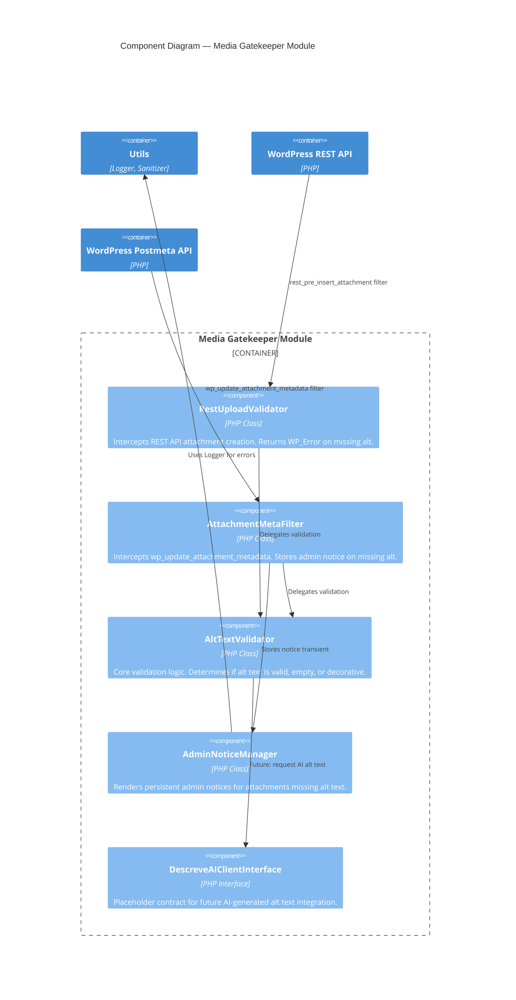

# Media Gatekeeper — Technical Specification

## Coverage Report

| FR     | Requirement Summary                                                  | Spec Element                                                                     | Status     |
| ------ | -------------------------------------------------------------------- | -------------------------------------------------------------------------------- | ---------- |
| FR-010 | Block publish on missing alt text in Gutenberg                       | `AltTextValidator` class + BR-MG-001 + Gherkin scenarios                         | 🟢 Covered |
| FR-003 | DOM manipulation via `DOMDocument` only — Regex prohibited           | Inherited from Phase 1. `AltTextValidator` uses WordPress metadata API, no DOM.  | 🟢 Covered |
| FR-005 | Zero custom DB tables                                                | Inherited from Phase 1. Module uses `wp_postmeta` exclusively.                   | 🟢 Covered |
| FR-006 | `declare(strict_types=1)` on every PHP file                         | ADR-004. Every `.php` file opens with the declaration.                           | 🟢 Covered |

**Coverage: 4/4 FRs mapped. 0 blocked upstream.**

**Upstream Dependency (Deferred — Not Blocked):**

| Dependency        | Status      | Impact on Spec                                                                 |
| ----------------- | ----------- | ------------------------------------------------------------------------------ |
| DescreveAI API    | 🟡 Deferred | Interface contract defined as placeholder (`DescreveAIClientInterface`). Module operates independently without it. When DescreveAI is ready, the concrete adapter is injected — zero changes to `AltTextValidator`. |

---

## Architecture Snapshot (from SDD)

- **Stack:** PHP 8.1+ / WordPress 6.4+ / `wp_postmeta` API / REST API v2 / Admin-AJAX
- **Module location:** `src/Modules/MediaGatekeeper/`
- **Entry points:**
  - `AttachmentMetaFilter::validateOnSave()` registered via `add_filter('wp_update_attachment_metadata', ..., 10, 2)`
  - `RestUploadValidator::validateRestInsert()` registered via `add_filter('rest_pre_insert_attachment', ..., 10, 2)`
  - `AdminNoticeManager::displayPendingNotices()` registered via `add_action('admin_notices', ...)`
- **Data flow (REST/Gutenberg):**
  ```
  Gutenberg Upload → REST API POST /wp/v2/media
    → WordPress stores file on disk (physical upload SUCCEEDS)
    → rest_pre_insert_attachment filter fires
    → RestUploadValidator checks _wp_attachment_image_alt in request
    → IF image AND alt empty → WP_Error returned (HTTP 403)
    → IF non-image (PDF, etc.) → pass through
    → IF alt present OR decorative flag → allow
  ```
- **Data flow (Classic Editor / admin-ajax.php):**
  ```
  Classic Editor Upload → admin-ajax.php (async-upload.php)
    → WordPress stores file on disk (physical upload SUCCEEDS)
    → wp_update_attachment_metadata filter fires
    → AttachmentMetaFilter checks _wp_attachment_image_alt in postmeta
    → IF image AND alt empty → stores admin notice transient, returns metadata (non-blocking)
    → Admin reloads → admin_notices displays persistent warning
  ```
- **API style:** WordPress Filter API + REST API error responses
- **ADRs applied:** ADR-001 (DOMDocument — inherited), ADR-002 (Lean Database), ADR-004 (strict_types), ADR-006 (modular DDD)

---

## Component Diagram (Level 3) — Media Gatekeeper Internal



---

## WordPress Hook/Filter Registry — Media Gatekeeper

| Hook/Filter                       | Type   | Class                    | Priority | Callback                                      | Description                                                    |
| --------------------------------- | ------ | ------------------------ | -------- | --------------------------------------------- | -------------------------------------------------------------- |
| `rest_pre_insert_attachment`      | Filter | `RestUploadValidator`    | `10`     | `validateRestInsert($prepared, $request)`      | Intercepts Gutenberg/REST attachment creation. Returns `WP_Error` if image has no alt. |
| `wp_update_attachment_metadata`   | Filter | `AttachmentMetaFilter`   | `10`     | `validateOnSave($metadata, $attachmentId)`     | Intercepts Classic Editor metadata save. Stores admin notice transient. |
| `admin_notices`                   | Action | `AdminNoticeManager`     | `10`     | `displayPendingNotices()`                      | Renders queued alt-text warnings in wp-admin.                  |
| `delete_attachment`               | Action | `AdminNoticeManager`     | `10`     | `clearNoticeForAttachment($attachmentId)`      | Cleans up notice transient when attachment is deleted.          |
| `add_attachment`                  | Action | `AttachmentMetaFilter`   | `10`     | `onAttachmentAdded($attachmentId)`             | Fires on new upload — validates alt text immediately.          |

**Design Decision: Why two hooks instead of one?**

The WordPress media system has two distinct upload paths:

1. **Gutenberg (REST API):** Uploads via `POST /wp/v2/media`. The `rest_pre_insert_attachment` filter can return a `WP_Error` which the Block Editor displays inline as a dismissible snackbar error. This is the **blocking** path.

2. **Classic Editor (admin-ajax.php):** Uploads via `async-upload.php`. There is no filter that can cleanly reject the upload without breaking the Media Library UI. The `wp_update_attachment_metadata` filter fires *after* the file is stored, so we use it for **non-blocking warnings** via admin notices.

Both paths delegate to the same `AltTextValidator` — the validation logic is unified, only the delivery mechanism differs.

---

## Type System — PHP Class Contracts

### AltTextValidator

```php
<?php declare(strict_types=1);

namespace WpAcessivelJinc\Modules\MediaGatekeeper;

/**
 * Core validation engine for alt text on image attachments.
 * Stateless — all state comes from function arguments.
 *
 * @spec-ref FR-010, BR-MG-001, BR-MG-002
 */
final class AltTextValidator
{
    /**
     * Validate alt text for a given attachment.
     *
     * @param int $attachmentId WordPress attachment post ID.
     * @return AltTextValidationResult Validation result with status and diagnostics.
     *
     * Preconditions:
     *   - $attachmentId refers to an existing attachment post
     *
     * Postconditions:
     *   - Never modifies the attachment or its metadata
     *   - Returns a value object describing the validation state
     *
     * Algorithm:
     *   1. Get attachment mime type via get_post_mime_type($attachmentId)
     *   2. IF mime type does NOT start with "image/" → return SKIP (non-image)
     *   3. Get alt text via get_post_meta($attachmentId, '_wp_attachment_image_alt', true)
     *   4. IF alt text (trimmed, case-insensitive) === "decorativo" → set alt="",
     *      store meta '_jinc_decorative' = '1', return DECORATIVE
     *   5. IF alt text is non-empty string after trim → return VALID
     *   6. IF attachment has meta '_jinc_decorative' === '1' → return DECORATIVE
     *   7. ELSE → return MISSING
     */
    public function validate(int $attachmentId): AltTextValidationResult;

    /**
     * Validate alt text from a raw string value (for pre-insert validation
     * where the attachment may not yet exist in the database).
     *
     * @param string $altText The alt text string to validate.
     * @param string $mimeType The MIME type of the file being uploaded.
     * @param bool $isDecorative Whether the image is marked as decorative.
     * @return AltTextValidationResult Validation result.
     */
    public function validateRaw(string $altText, string $mimeType, bool $isDecorative = false): AltTextValidationResult;
}

/**
 * @spec-ref FR-010
 */
final readonly class AltTextValidationResult
{
    public function __construct(
        public AltTextStatus $status,
        public int $attachmentId,
        public string $mimeType,
        public string $altText,
        public string $message,
    ) {}

    public function isBlocking(): bool
    {
        return $this->status === AltTextStatus::MISSING;
    }
}

/**
 * @spec-ref FR-010, BR-MG-001
 */
enum AltTextStatus: string
{
    case VALID      = 'valid';       // Non-empty alt text present
    case MISSING    = 'missing';     // Image with no alt text — blocking
    case DECORATIVE = 'decorative';  // Explicitly marked decorative (alt="")
    case SKIPPED    = 'skipped';     // Non-image file (PDF, etc.) — no validation
}
```

### RestUploadValidator

```php
<?php declare(strict_types=1);

namespace WpAcessivelJinc\Modules\MediaGatekeeper;

/**
 * Intercepts REST API attachment creation to enforce alt text on images.
 * Returns WP_Error to Gutenberg when alt text is missing.
 *
 * @spec-ref FR-010, BR-MG-001
 *
 * Hook: add_filter('rest_pre_insert_attachment', [$this, 'validateRestInsert'], 10, 2)
 *
 * Behavior:
 *   - Extracts alt_text from $request['alt_text'] (REST API field)
 *   - Extracts mime_type from $request['mime_type'] or the prepared post
 *   - Delegates to AltTextValidator::validateRaw()
 *   - IF result is MISSING → return WP_Error('jinc_alt_text_missing', ..., ['status' => 403])
 *   - IF result is VALID, DECORATIVE, or SKIPPED → return $prepared (pass through)
 */
final class RestUploadValidator
{
    public function __construct(
        private readonly AltTextValidator $validator,
        private readonly \WpAcessivelJinc\Utils\Logger $logger,
    ) {}

    /**
     * Register the REST API filter.
     */
    public function register(): void;

    /**
     * Filter callback for rest_pre_insert_attachment.
     *
     * @param \stdClass|\WP_Error $prepared Prepared post data or existing WP_Error.
     * @param \WP_REST_Request $request The REST request object.
     * @return \stdClass|\WP_Error Pass-through or error.
     */
    public function validateRestInsert(\stdClass|\WP_Error $prepared, \WP_REST_Request $request): \stdClass|\WP_Error;
}
```

### AttachmentMetaFilter

```php
<?php declare(strict_types=1);

namespace WpAcessivelJinc\Modules\MediaGatekeeper;

/**
 * Intercepts attachment metadata save (Classic Editor path).
 * Non-blocking: stores admin notice transient for display.
 *
 * @spec-ref FR-010, BR-MG-003
 *
 * Hooks:
 *   - add_filter('wp_update_attachment_metadata', [$this, 'validateOnSave'], 10, 2)
 *   - add_action('add_attachment', [$this, 'onAttachmentAdded'], 10, 1)
 *
 * Behavior:
 *   - Delegates to AltTextValidator::validate($attachmentId)
 *   - IF result is MISSING → stores transient 'jinc_mg_notices_{user_id}' with attachment ID
 *   - Always returns $metadata unmodified (never blocks the upload)
 */
final class AttachmentMetaFilter
{
    public function __construct(
        private readonly AltTextValidator $validator,
        private readonly AdminNoticeManager $noticeManager,
        private readonly \WpAcessivelJinc\Utils\Logger $logger,
    ) {}

    public function register(): void;

    /**
     * @param array<string, mixed> $metadata Attachment metadata array.
     * @param int $attachmentId Attachment post ID.
     * @return array<string, mixed> Unmodified metadata.
     */
    public function validateOnSave(array $metadata, int $attachmentId): array;

    /**
     * @param int $attachmentId Attachment post ID.
     */
    public function onAttachmentAdded(int $attachmentId): void;
}
```

### AdminNoticeManager

```php
<?php declare(strict_types=1);

namespace WpAcessivelJinc\Modules\MediaGatekeeper;

/**
 * Manages persistent admin notices for alt text violations.
 * Uses user-specific transients to avoid cross-user pollution.
 *
 * @spec-ref FR-010, BR-MG-003
 *
 * Transient key: 'jinc_mg_notices_{user_id}'
 * Value: array<int> — list of attachment IDs missing alt text
 * TTL: 0 (no expiration — cleared on dismiss or alt text fix)
 */
final class AdminNoticeManager
{
    /**
     * Queue a notice for a specific attachment.
     *
     * @param int $attachmentId Attachment post ID missing alt text.
     */
    public function queueNotice(int $attachmentId): void;

    /**
     * Display all pending notices for the current user.
     * Renders one consolidated notice, not one per attachment.
     *
     * Output HTML structure:
     *   <div class="notice notice-warning is-dismissible" role="alert">
     *     <p><strong>WP Acessível JINC:</strong> {N} imagem(ns) sem texto alternativo.</p>
     *     <ul>
     *       <li><a href="{edit_link}">"{filename}" (ID: {id})</a> — sem alt text</li>
     *       ...
     *     </ul>
     *     <p><small>Adicione alt text descritivo no campo "Texto Alternativo" de cada imagem.</small></p>
     *   </div>
     */
    public function displayPendingNotices(): void;

    /**
     * Clear notice for a specific attachment (when alt text is added or attachment deleted).
     *
     * @param int $attachmentId Attachment post ID.
     */
    public function clearNoticeForAttachment(int $attachmentId): void;

    /**
     * Clear all notices for the current user.
     */
    public function clearAllNotices(): void;
}
```

### DescreveAIClientInterface (Placeholder)

```php
<?php declare(strict_types=1);

namespace WpAcessivelJinc\Modules\MediaGatekeeper;

/**
 * Contract for the DescreveAI integration (Phase 3).
 * The Media Gatekeeper will call this to request AI-generated alt text.
 *
 * @spec-ref FR-020 (deferred to Scale phase)
 *
 * This interface exists NOW so the AltTextValidator can be designed
 * with an optional dependency injection point. The concrete implementation
 * will be provided when the DescreveAI API is stable.
 *
 * In Phase 2, the NullDescreveAIClient is injected (returns null always).
 */
interface DescreveAIClientInterface
{
    /**
     * Request AI-generated alt text for an image.
     *
     * @param int $attachmentId WordPress attachment post ID.
     * @param string $imageUrl Full URL to the image file.
     * @return DescreveAIResult|null Generated alt text, or null if service unavailable.
     */
    public function generateAltText(int $attachmentId, string $imageUrl): ?DescreveAIResult;
}

/**
 * @spec-ref FR-020
 */
final readonly class DescreveAIResult
{
    public function __construct(
        public string $altText,          // Generated alt text
        public float $confidence,        // 0.0–1.0 confidence score
        public string $model,            // Model identifier (e.g., "descreve-v2")
        public string $language,         // ISO 639-1 language code (e.g., "pt-BR")
    ) {}
}

/**
 * Null implementation for Phase 2 (no-op).
 * Injected by default until DescreveAI integration is activated.
 *
 * @spec-ref FR-020
 */
final class NullDescreveAIClient implements DescreveAIClientInterface
{
    public function generateAltText(int $attachmentId, string $imageUrl): ?DescreveAIResult
    {
        return null;
    }
}
```

---

## Business Rules

### BR-MG-001: Image Attachments Must Have Alt Text

```
BR-MG-001: Image Alt Text Enforcement (ALWAYS BLOCKING on REST)
  Precondition:  Attachment being inserted or saved is of MIME type "image/*"
  Input:         Attachment post ID or REST request with alt_text field
  Invariant:     No image attachment without alt text may be inserted into a post
                 via the REST API (Gutenberg). This is ALWAYS blocking — no configuration toggle.
                 Classic Editor path uses non-blocking warnings.
  Output:        VALID → attachment proceeds normally
                 MISSING → WP_Error (REST, HTTP 403) or admin notice (Classic)
                 DECORATIVE → attachment proceeds (alt="" is intentional)
                 SKIPPED → non-image files bypass validation entirely
  Violation:     Error code: JINC_ALT_TEXT_MISSING
                 Message: "Esta imagem requer texto alternativo (alt text) antes de ser inserida."
  I/O Example:
    REST Input:    POST /wp/v2/media { file: "photo.jpg", alt_text: "" }
    REST Output:   HTTP 403 { code: "jinc_alt_text_missing", message: "..." }
    Classic Input: Upload photo.jpg → metadata saved → alt empty
    Classic Output: Admin notice: "1 imagem sem texto alternativo."

  RESOLUTION (Approved 2026-06-25):
    The REST API blocking behavior is ABSOLUTE and NON-CONFIGURABLE.
    The setting 'block_publish' is REMOVED from the settings schema.
    Rationale: The plugin's philosophy is non-negotiable enforcement.
```

**Edge Cases Table:**

| Input                                              | Expected Output                                    | Rule Applied                         |
| -------------------------------------------------- | -------------------------------------------------- | ------------------------------------ |
| Image upload via REST, `alt_text: ""`              | `WP_Error` with code `jinc_alt_text_missing` (403) | BR-MG-001: MISSING                   |
| Image upload via REST, `alt_text: "Um gato preto"` | Attachment created normally                        | BR-MG-001: VALID                     |
| PDF upload via REST, `alt_text: ""`                | Attachment created normally (SKIPPED)              | BR-MG-001: non-image bypass          |
| Image with `_jinc_decorative: "1"` meta            | Attachment proceeds (DECORATIVE)                   | BR-MG-002: decorative override       |
| Image upload via REST, `alt_text: "decorativo"`    | DECORATIVE — alt cleared to "", flag stored         | BR-MG-002: semantic bypass           |
| Image upload via REST, `alt_text: "DECORATIVO"`    | DECORATIVE — case-insensitive match                | BR-MG-002: semantic bypass           |
| Image upload via Classic Editor, alt empty          | File uploaded, admin notice queued                  | BR-MG-003: non-blocking Classic path |
| Image upload via REST, alt is only whitespace       | `WP_Error` (whitespace-only ≡ empty after trim)    | BR-MG-001: MISSING                   |

---

### BR-MG-002: Decorative Images — Semantic Bypass

```
BR-MG-002: Decorative Image Bypass (Semantic Keyword)
  Precondition:  Image attachment exists
  Input:         Alt text string OR postmeta '_jinc_decorative' === '1'
  Invariant:     Decorative flag is an explicit opt-in via TWO mechanisms:
                 1. Postmeta '_jinc_decorative' === '1' (API/programmatic)
                 2. SEMANTIC BYPASS: alt text === "decorativo" (case-insensitive, trimmed)
                    When detected, the validator MUST:
                    a) Clear the alt text to "" (empty string)
                    b) Store postmeta '_jinc_decorative' = '1'
                    c) Return AltTextStatus::DECORATIVE
  Output:        AltTextStatus::DECORATIVE — validation passes, alt="" is stored intentionally
  Violation:     N/A — this is a valid state, not an error
  I/O Example:
    Input:  Attachment ID 99, alt = "Decorativo"
    Output: AltTextValidationResult { status: DECORATIVE, message: "Imagem marcada como decorativa." }
            Postmeta _wp_attachment_image_alt → "" (cleared)
            Postmeta _jinc_decorative → "1" (stored)

  RESOLUTION (Approved 2026-06-25):
    No React/JS UI injection in Phase 2. The decorative flag is set via
    a "semantic bypass" in the backend: typing "decorativo" as alt text.
    This avoids Media Library UI complexity in this phase.
```

---

### BR-MG-003: Classic Editor Uses Non-Blocking Warnings

```
BR-MG-003: Non-Blocking Classic Editor Path
  Precondition:  Upload occurs via admin-ajax.php / async-upload.php (not REST API)
  Input:         wp_update_attachment_metadata filter fires with new attachment metadata
  Invariant:     Physical file upload is NEVER blocked — only metadata flagging occurs
  Output:        Admin notice transient stored per-user with list of violating attachment IDs
  Violation:     N/A — warning only, not a blocking error
  I/O Example:
    Input:  Attachment ID 42 uploaded, no alt text
    Output: Transient 'jinc_mg_notices_{user_id}' contains [42]
            Admin panel displays: "1 imagem sem texto alternativo."
```

---

### BR-MG-004: DescreveAI Integration Point (Deferred)

```
BR-MG-004: AI-Generated Alt Text Injection Point
  Precondition:  DescreveAIClientInterface concrete implementation is injected (Phase 3)
  Input:         AltTextValidator detects MISSING alt text AND DescreveAI is available
  Invariant:     AI-generated alt text is NEVER auto-saved without user review
  Output:        Suggested alt text returned in validation result for UI display
                 User must explicitly accept/edit before it is saved to postmeta
  Violation:     N/A — deferred to Phase 3. NullDescreveAIClient returns null.
  I/O Example:
    Input:  Attachment ID 50, alt empty, DescreveAI available
    Output: AltTextValidationResult { status: MISSING, suggestedAlt: "Fotografia de um gato preto..." }
            User sees suggestion in Media Library → accepts → alt saved
```

---

## UX / Admin Interaction Design

### REST API Error Response (Gutenberg)

When `RestUploadValidator` blocks an image, Gutenberg receives a standard `WP_Error`:

```json
{
  "code": "jinc_alt_text_missing",
  "message": "WP Acessível JINC: Esta imagem requer texto alternativo (alt text) antes de ser inserida no post. Adicione uma descrição no campo \"Texto Alternativo\" da Biblioteca de Mídia.",
  "data": {
    "status": 403,
    "attachment_id": null,
    "filename": "photo.jpg",
    "mime_type": "image/jpeg"
  }
}
```

**Gutenberg Behavior:** The Block Editor displays this as a **red snackbar notification** at the bottom of the editor. The image block shows an error state. The user must:
1. Open the Media Library
2. Add alt text to the image
3. Re-insert the image

### Admin Notice (Classic Editor)

Rendered by `AdminNoticeManager::displayPendingNotices()`:

```html
<div class="notice notice-warning is-dismissible" role="alert" aria-live="polite">
  <p>
    <strong>WP Acessível JINC:</strong>
    2 imagem(ns) enviada(s) sem texto alternativo (alt text).
  </p>
  <ul>
    <li>
      <a href="/wp-admin/post.php?post=42&action=edit">"foto-evento.jpg" (ID: 42)</a>
      — sem alt text
    </li>
    <li>
      <a href="/wp-admin/post.php?post=55&action=edit">"banner-home.png" (ID: 55)</a>
      — sem alt text
    </li>
  </ul>
  <p>
    <small>Adicione alt text descritivo no campo "Texto Alternativo" de cada imagem na
    <a href="/wp-admin/upload.php">Biblioteca de Mídia</a>.</small>
  </p>
</div>
```

**Accessibility of the notice itself:**
- `role="alert"` ensures screen readers announce it immediately
- `aria-live="polite"` for non-intrusive re-announcements
- Links are descriptive (include filename and ID)
- `is-dismissible` adds WordPress native dismiss button with keyboard support

---

## Error Code Registry

| Code                       | Context               | Trigger Condition                            | Behavior                                              |
| -------------------------- | --------------------- | -------------------------------------------- | ----------------------------------------------------- |
| `JINC_ALT_TEXT_MISSING`    | RestUploadValidator   | Image uploaded via REST with empty alt text   | Return `WP_Error`, HTTP 403. Log warning.             |
| `JINC_MG_NOTICE_QUEUED`    | AttachmentMetaFilter  | Image uploaded via Classic with empty alt     | Queue admin notice. Log info. Return metadata.        |
| `JINC_MG_SKIPPED`          | AltTextValidator      | Non-image file uploaded                      | Pass through silently. Log debug (if debug enabled).  |
| `JINC_MG_DECORATIVE`       | AltTextValidator      | Image marked as decorative                   | Pass through. Log info.                               |

All errors are **silent to end visitors**. They are logged to `error_log()` with `[WP-Acessível-JINC][MediaGatekeeper]` prefix and relevant context (attachment_id, filename, mime_type).

---

## Critical Path — Gherkin

### Feature: Alt Text Enforcement on Image Upload (REST/Gutenberg)

```gherkin
Feature: Alt Text Enforcement on Image Upload

  Scenario: Happy path — image with alt text is accepted via REST
    Given the Media Gatekeeper module is enabled with "block_publish" = true
    And a REST API request to POST /wp/v2/media with file "photo.jpg" (image/jpeg)
    And the request includes alt_text = "Fotografia de uma reunião de equipe"
    When the REST endpoint processes the upload
    Then the attachment is created successfully with HTTP 201
    And the alt text is stored in postmeta '_wp_attachment_image_alt'
    And no error or notice is generated

  Scenario: Edge case — image without alt text is blocked via REST
    Given the Media Gatekeeper module is enabled with "block_publish" = true
    And a REST API request to POST /wp/v2/media with file "banner.png" (image/png)
    And the request includes alt_text = ""
    When the REST endpoint processes the upload
    Then the file is physically stored on disk (upload succeeds)
    But the REST response returns HTTP 403 with code "jinc_alt_text_missing"
    And the Gutenberg editor displays the error message as a snackbar notification

  Scenario: Edge case — PDF upload is not validated
    Given the Media Gatekeeper module is enabled
    And a REST API request to POST /wp/v2/media with file "report.pdf" (application/pdf)
    And the request includes alt_text = ""
    When the REST endpoint processes the upload
    Then the attachment is created successfully with HTTP 201
    And no validation error is returned (PDFs are not images)
```

### Feature: Alt Text Warning on Classic Editor Upload

```gherkin
Feature: Alt Text Warning on Classic Editor Upload

  Scenario: Happy path — Classic Editor upload with missing alt shows warning
    Given the Media Gatekeeper module is enabled
    And an image "photo.jpg" is uploaded via the Classic Editor Media Library
    And the alt text field is left empty
    When the user navigates to any wp-admin page
    Then a warning notice is displayed: "1 imagem(ns) sem texto alternativo"
    And the notice contains a link to edit the attachment
    And the notice is dismissible

  Scenario: Edge case — decorative image is accepted with empty alt
    Given the Media Gatekeeper module is enabled with "allow_decorative" = true
    And an image "divider.png" is uploaded
    And the postmeta '_jinc_decorative' is set to "1"
    And the alt text is empty
    When validation runs
    Then the result status is DECORATIVE
    And no warning or error is generated
```

### Feature: Idempotent Notice Management

```gherkin
Feature: Idempotent Notice Management

  Scenario: Notice cleared when alt text is added
    Given attachment ID 42 has a pending alt text notice
    When the user edits attachment 42 and adds alt text "Descrição da imagem"
    And the attachment metadata is saved
    Then the notice for attachment 42 is removed from the transient
    And the admin notice no longer displays attachment 42
```

---

## Test Scaffolding — PHPUnit

```php
<?php declare(strict_types=1);

/**
 * @spec-source docs/SPEC_MediaGatekeeper.md
 * @coverage 4 business rules, 6 Gherkin scenarios, 2 hook entry points
 *
 * Scaffold from Spec. Fill in test bodies.
 * Do not add tests not present in spec.md — update the Spec first.
 */

namespace WpAcessivelJinc\Tests\Unit;

use PHPUnit\Framework\TestCase;
use WpAcessivelJinc\Modules\MediaGatekeeper\AltTextValidator;
use WpAcessivelJinc\Modules\MediaGatekeeper\AltTextValidationResult;
use WpAcessivelJinc\Modules\MediaGatekeeper\AltTextStatus;
use WpAcessivelJinc\Modules\MediaGatekeeper\AdminNoticeManager;

class AltTextValidatorTest extends TestCase
{
    // ── BR-MG-001: Image with valid alt text passes ──

    /** @test */
    public function it_returns_valid_for_image_with_alt_text(): void
    {
        // Input:    mimeType = "image/jpeg", altText = "Um gato preto"
        // Expected: AltTextStatus::VALID
    }

    // ── BR-MG-001: Image with empty alt text returns MISSING ──

    /** @test */
    public function it_returns_missing_for_image_without_alt_text(): void
    {
        // Input:    mimeType = "image/png", altText = ""
        // Expected: AltTextStatus::MISSING, isBlocking() === true
    }

    // ── BR-MG-001: Whitespace-only alt text is treated as empty ──

    /** @test */
    public function it_returns_missing_for_whitespace_only_alt_text(): void
    {
        // Input:    mimeType = "image/jpeg", altText = "   \t  "
        // Expected: AltTextStatus::MISSING
    }

    // ── BR-MG-001: Non-image files bypass validation ──

    /** @test */
    public function it_returns_skipped_for_non_image_mime_types(): void
    {
        // Input:    mimeType = "application/pdf", altText = ""
        // Expected: AltTextStatus::SKIPPED
    }

    /** @test */
    public function it_returns_skipped_for_video_mime_types(): void
    {
        // Input:    mimeType = "video/mp4", altText = ""
        // Expected: AltTextStatus::SKIPPED
    }

    // ── BR-MG-002: Decorative images bypass with empty alt ──

    /** @test */
    public function it_returns_decorative_when_flag_is_set(): void
    {
        // Input:    mimeType = "image/png", altText = "", isDecorative = true
        // Expected: AltTextStatus::DECORATIVE
    }

    /** @test */
    public function it_returns_valid_even_if_decorative_and_alt_present(): void
    {
        // Input:    mimeType = "image/png", altText = "Some text", isDecorative = true
        // Expected: AltTextStatus::VALID (alt text takes precedence)
    }

    // ── BR-MG-001: SVG images are validated ──

    /** @test */
    public function it_validates_svg_images(): void
    {
        // Input:    mimeType = "image/svg+xml", altText = ""
        // Expected: AltTextStatus::MISSING
    }

    // ── BR-MG-001: WebP images are validated ──

    /** @test */
    public function it_validates_webp_images(): void
    {
        // Input:    mimeType = "image/webp", altText = "A landscape photo"
        // Expected: AltTextStatus::VALID
    }

    // ── BR-MG-003: Validation is idempotent ──

    /** @test */
    public function it_produces_identical_result_on_repeated_validation(): void
    {
        // Input:    Same arguments twice
        // Assert:   validate(x) === validate(x)
    }
}

class RestUploadValidatorTest extends TestCase
{
    // ── BR-MG-001: REST insert returns WP_Error on missing alt ──

    /** @test */
    public function it_returns_wp_error_when_image_has_no_alt_via_rest(): void
    {
        // Input:    Mocked WP_REST_Request with file "photo.jpg", alt_text = ""
        // Expected: WP_Error with code "jinc_alt_text_missing", status 403
    }

    /** @test */
    public function it_passes_through_when_image_has_alt_via_rest(): void
    {
        // Input:    Mocked WP_REST_Request with file "photo.jpg", alt_text = "Valid description"
        // Expected: $prepared object returned unchanged
    }

    /** @test */
    public function it_passes_through_for_non_image_uploads_via_rest(): void
    {
        // Input:    Mocked WP_REST_Request with file "report.pdf"
        // Expected: $prepared object returned unchanged
    }

    /** @test */
    public function it_passes_through_when_existing_wp_error_is_present(): void
    {
        // Input:    $prepared is already a WP_Error from a previous filter
        // Expected: Returns the existing WP_Error without overwriting
    }
}

class AttachmentMetaFilterTest extends TestCase
{
    // ── BR-MG-003: Classic upload queues admin notice ──

    /** @test */
    public function it_queues_notice_when_image_missing_alt_on_metadata_save(): void
    {
        // Input:    Attachment ID 42, mime "image/jpeg", no alt text
        // Expected: AdminNoticeManager::queueNotice(42) called
        //           $metadata returned unmodified
    }

    /** @test */
    public function it_does_not_queue_notice_for_non_image_attachments(): void
    {
        // Input:    Attachment ID 43, mime "application/pdf"
        // Expected: AdminNoticeManager::queueNotice() NOT called
    }

    /** @test */
    public function it_returns_metadata_unmodified_always(): void
    {
        // Input:    Any attachment metadata array
        // Expected: Exact same array returned (no mutation)
    }
}

class AdminNoticeManagerTest extends TestCase
{
    // ── BR-MG-003: Notice rendering ──

    /** @test */
    public function it_renders_consolidated_notice_for_multiple_attachments(): void
    {
        // Input:    Transient contains [42, 55]
        // Expected: Single <div class="notice"> with 2 list items
    }

    /** @test */
    public function it_renders_nothing_when_no_pending_notices(): void
    {
        // Input:    Transient is empty or missing
        // Expected: No HTML output
    }

    /** @test */
    public function it_clears_specific_attachment_from_notice_list(): void
    {
        // Input:    Transient contains [42, 55], clear(42)
        // Expected: Transient now contains [55]
    }

    /** @test */
    public function it_clears_all_notices_for_current_user(): void
    {
        // Input:    Transient contains [42, 55]
        // Expected: Transient deleted entirely
    }

    /** @test */
    public function it_does_not_duplicate_attachment_ids_in_queue(): void
    {
        // Input:    queueNotice(42), queueNotice(42)
        // Expected: Transient contains [42] (not [42, 42])
    }

    // ── Accessibility of notice HTML ──

    /** @test */
    public function it_renders_notice_with_aria_attributes(): void
    {
        // Input:    Transient contains [42]
        // Expected: Output contains role="alert" and aria-live="polite"
    }
}
```

---

## Directory Structure Update

```
src/Modules/MediaGatekeeper/
├── AltTextValidator.php            ← Core validation logic (stateless)
├── AltTextValidationResult.php     ← Value object for validation result
├── AltTextStatus.php               ← Enum: VALID | MISSING | DECORATIVE | SKIPPED
├── RestUploadValidator.php         ← REST API filter (Gutenberg blocking path)
├── AttachmentMetaFilter.php        ← Classic Editor filter (non-blocking path)
├── AdminNoticeManager.php          ← Persistent admin notice rendering
├── DescreveAIClientInterface.php   ← Future integration contract
├── DescreveAIResult.php            ← Value object for AI response
└── NullDescreveAIClient.php        ← No-op implementation (Phase 2 default)

tests/Unit/
├── AltTextValidatorTest.php        ← 10 test methods
├── RestUploadValidatorTest.php     ← 4 test methods
├── AttachmentMetaFilterTest.php    ← 3 test methods
└── AdminNoticeManagerTest.php      ← 6 test methods
```

---

## Settings Schema Impact (wp_options update)

The `media_gatekeeper` section in `wp_acessivel_jinc_settings` already defined in SDD.md:

```php
'media_gatekeeper' => [
    'enabled'          => false,   // bool — V1, disabled by default
    'block_publish'    => true,    // bool — block REST insert on missing alt
    'allow_decorative' => true,    // bool — allow empty alt for decorative images
],
```

No new settings required. The existing schema covers all configuration needs.

---

## Downstream Pipeline

This Spec is ready for implementation:

```
PRD (docs/PRD.md) ──► SDD (docs/SDD.md) ──► Spec (this document) ──► Code
                                                    ↑ you are here
```

**Implementation Order:**

1. `Modules/MediaGatekeeper/AltTextStatus.php` — enum, no dependencies
2. `Modules/MediaGatekeeper/AltTextValidationResult.php` — value object, depends on enum
3. `Modules/MediaGatekeeper/DescreveAIResult.php` — value object, no dependencies
4. `Modules/MediaGatekeeper/DescreveAIClientInterface.php` — interface, depends on result VO
5. `Modules/MediaGatekeeper/NullDescreveAIClient.php` — null impl, depends on interface
6. `Modules/MediaGatekeeper/AltTextValidator.php` — core logic, depends on enum + result + interface
7. `Modules/MediaGatekeeper/AdminNoticeManager.php` — notice system, standalone
8. `Modules/MediaGatekeeper/AttachmentMetaFilter.php` — Classic path, depends on validator + notices
9. `Modules/MediaGatekeeper/RestUploadValidator.php` — REST path, depends on validator + logger
10. Tests: Unit (AltTextValidatorTest → RestUploadValidatorTest → AttachmentMetaFilterTest → AdminNoticeManagerTest)

| Status           | Value                                                   |
| ---------------- | ------------------------------------------------------- |
| Spec Status      | draft                                                   |
| Ready for Code?  | 🟢 Yes — all FRs covered, BRs defined, tests scaffolded |
| PRD Alignment    | 🟢 No upstream conflicts                                |
| SDD Alignment    | 🟢 Architecture, ADRs, and hook registry consistent     |
